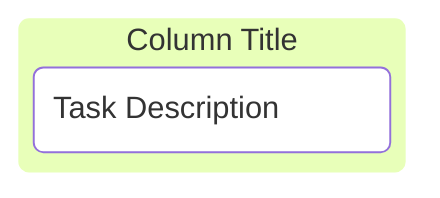

# Mermaid Grammar

[toc]

## kanban

A Kanban diagram in Mermaid starts with the kanban keyword, followed by the definition of columns (stages) and tasks within those columns.

`kanban`的基础语法为：

```txt
kanban
  column1[Column Title]
    task1[Task Description]
```

效果如下所示：



其中，identifier（column1、task1）可以省略。
