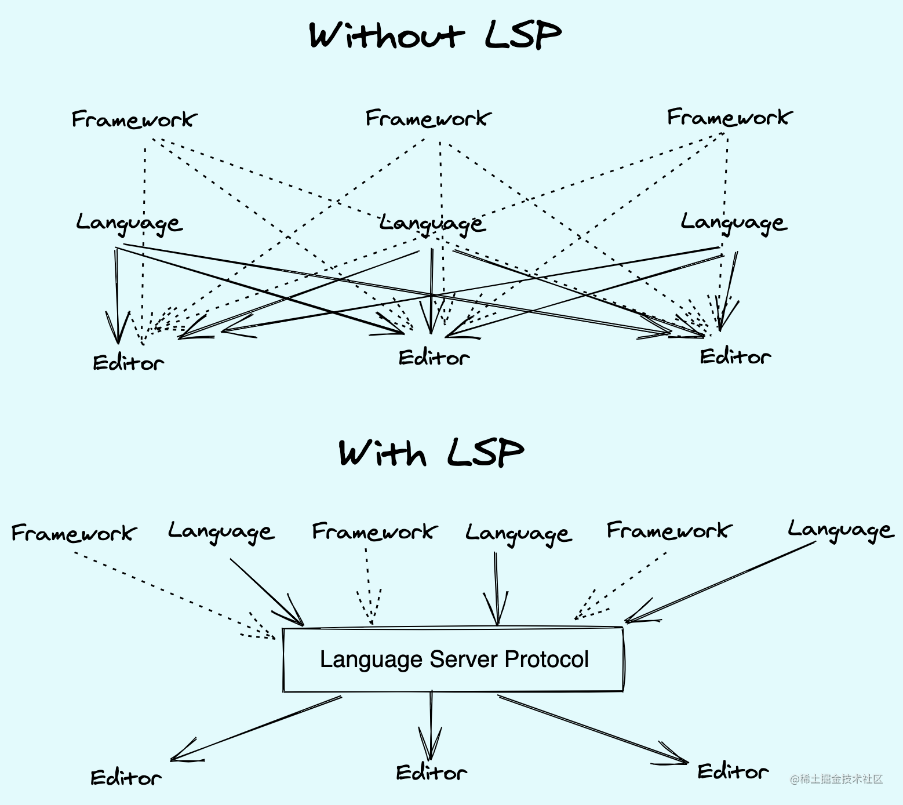
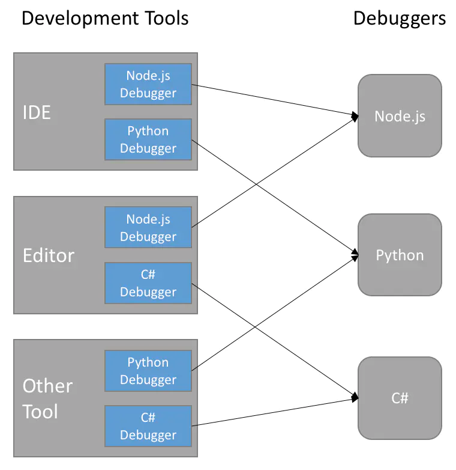
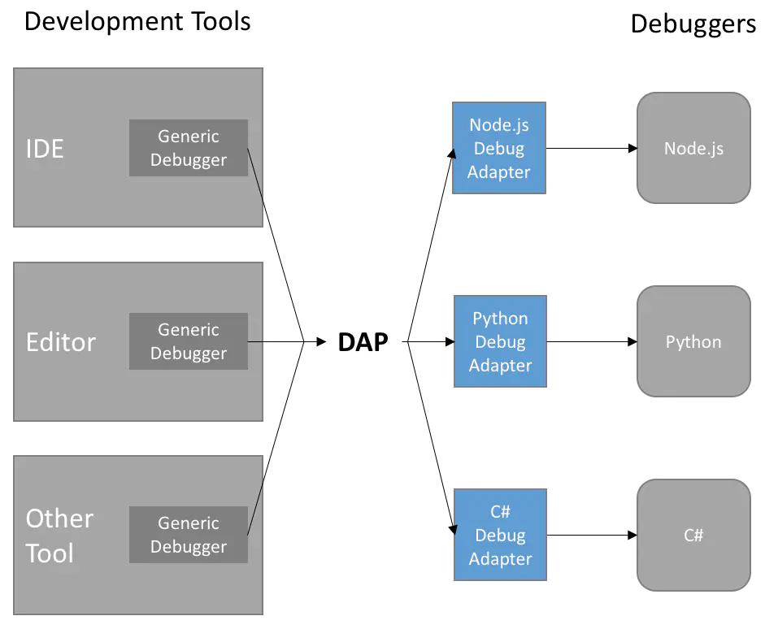

# Visual Studio Code

## 相关参考

《Visual Studio Code权威指南》韩骏著

## 核心组件

- Electron
Electron原名为Atom Shell，是由GitHub开发的一个开源框架。Electron以Node.js作为运行时（runtime），以Chromium作为渲染引擎，使开发者可以使用HTML、CSS和JaveScript这样的前端技术栈来开发跨平台桌面GUI应用程序。

- Monaco Editor
Monaco Editor是Visual Studio Code最核心的组件。
它是一个基于浏览器的代码编辑器，支持业界主流的浏览器。

- TypeScript
Visual Studio Code选择TypeScript来进行开发。
TypeScript是JavaScript的严格超集

- Language Server Protocol
语言服务器（Language Server）提供了诸如自动补全、定义跳转、代码格式化等与变成语言相关的功能。
Language Server Protocol（LSP）是编辑器/IDE与语言服务器之间的一种协议，通过JSON-RPC传输消息，可以让不同的编辑器/IDE方便嵌入各种编程语言，使得开发人员能够在最喜爱的工具中使用各种语言来编写程序。
如果没有LSP，编辑器/IDE需要针对每种语言进行适配工作，语言工具也需要针对每个编辑器/IDE进行适配工作
而有了LSP后，编辑器/IDE和语言工具只需要针对LSP进行适配即可，这样编辑器/IDE可以快速集成多个兼容LSP的语言工具，语言服务器运行在自己的进程之中，不会影响到代码编辑器/IDE的性能，实现了前端的界面与后端的与语言相关的实现进行解耦。

- Debug Adapter Protocol
类似与LSP，DAP实现了代码编辑器/IDE和Debugger之间的解耦，大大降低了适配工作量。
由于难以保证现有的调试工具能够兼容DAP，因此Visual Studio Code的开发团队设计了一个中间层组件——Debug Adapter，以帮助现有调试工具和DAP的兼容

- Xterm.js
Xterm.js是一个使用TypeScript开发的前端组件，它把完整的终端功能带入了浏览器。
它可以与bash这样的进程相连，让用户通过Xterm.js进行交互。

## 安装

Windows下安装Visual Studio Code，有“用户安装”和“系统安装”两种模式，其中“用户安装”会安装到C:\\users\\{username}\\AppData\\Local\\Programs\\下，由于不需要管理员权限，故而拥有更加顺滑的后台更新体验
而“系统安装”则是安装在了C:\\Program Files\\目录下，安装和更新需要管理员权限
推荐使用“用户安装”

## 发布

- Visual Studio Code：每月发布一次，发布之前会经过全量的测试
- Visual Studio Code Insiders：每天更新，只需要经过单元测试 

## 设置

### 设置范围

- 用户设置（User Settings）

    全局生效
    JSON文件位置：~\AppData\Roaming\Code\User\settings.json

- 工作区设置（Workspace Settings）

    相应工作区生效
    JSON文件位置：根目录的.vscode文件夹下

### 设置方式

1.设置编辑器

- 打开方式
    - 菜单项（workbench.settings.editor项为ui）：File——Preferences——Settings
    - 快捷键（workbench.settings.editor项为ui）：ctrl+,
    - 命令面板（workbench.settings.editor项为ui）：Preferences:Open Settings
    - 命令面板：Preferences:Open Settings(UI)

2.JSON设置文件

- 打开方式
    - 菜单项（workbench.settings.editor项为json）：File——Preferences——Settings
    - 快捷键（workbench.settings.editor项为json）：ctrl+,
    - 命令面板（workbench.settings.editor项为json）：Preferences:Open Settings
    - 命令面板：Preferences:Open Settings(JSON)
    - 跳转：设置编辑器中点击右上角的“Open Settings(JSON)”按钮

### 设置项

- 针对编程语言设置

    "[language]": {...}

- terminal integrated

    terminal.integrated.profiles.__：针对特定平台（windows, linux, osx），设置集成终端的参数
    terminal.integrated.defaultProfile.__：针对特定平台（windows, linux, osx），设置默认的集成终端
    terminal.external.__Exec：针对特定平台（windows, linux, osx），设置外部打开的新终端

- format

    editor.formatOnType：输入一行后，自动格式化当前行
    editor.formatOnPaste：粘贴内容的时候是否格式化（需要有可用的 formatter）
    editor.formatOnSave：保存文件内容的时候是否格式化（需要有可用的 formatter）

- size

    editor.fontSize：控制字体的像素大小
    terminal.integrated.fontSize：控制集成终端字体的像素大小
    "[language]": { "editor.fontSize": 35 }：控制特定语言字体的像素大小
    window.zoomLevel：控制窗口的缩放级别

- font

    editor.fontFamily：设置字体族
    editor.fontLigatures：设置连字符启用/禁用

- save

    files.autoSave：设置自动保存的方式
    files.autoSaveDelay：设置自动保存的延迟时间
    files.hotExit：选择热退出的方式

- space

    editor.tabSize：制表符对应的空格数
    editor.insertSpaces：按下Tab键时，插入空格还是制表符
    editor.renderWhitespace：显示空格的方式

- file

    "files.exclude": {
        "somefolder/": true,
        "somefile": true
    }：设置资源管理器要隐藏的或显示的文件或文件夹（global模式）

    "search.exclude": {
        "somefolder/": true,
        "somefile": true
    }：设置搜索时要隐藏的或显示的文件或文件夹（global模式）

- layout

    workbench.editor.openSideBySideDirection：设置打开的编辑器在已打开编辑器的相对位置
    editor.minimap.autohide：设置缩略图是否自动隐藏
    editor.minimap.enabled：设置缩略图是否显示
    editor.minimap.maxColumn：设置缩略图显示的行数
    editor.minimap.renderCharacters：设置缩略图渲染字符的方式
    editor.minimap.scale：设置缩略图的规模
    editor.minimap.showSlider：设置缩略图何时显示
    editor.minimap.side：设置缩略图显示的位置
    editor.minimap.size：设置缩略图的大小
	breadcrumbs.enabled：设置面包屑导航是否显示
	breadcrumbs.filePath：设置面包屑导航显示文件路径的方式
    breadcrumbs.icons：设置是否使用图标渲染面包屑导航
    breadcrumbs.symbolPath：设置面包屑导航在导航路径视图中如何显示符号
    breadcrumbs.symbolSortOrder：设置面包屑导航符号排序的方式
    workbench.editor.showTabs：设置编辑页面是否显示在标签里
    workbench.editor.openPositioning：设置新打开标签的位置
    window.openFoldersInNewWindow：是否在新窗口打开文件夹
    window.openFilesInNewWindow：是否在新窗口打开文件
    window.restoreWindows：设置恢复之前会话窗口的方式

- 缩进

    editor.insertSpaces：按下Tab是否插入空格
    editor.tabSize：按下Tab插入多少空格

- 编码

    files.autoGuessEncoding：设置是否自动识别文件的编码格式
    files.encoding：设置文件的编码格式

- 主题

    workbench.colorTheme：设置颜色主题
    workbench.iconTheme：设置文件图标主题

- integrated terminal

    terminal.integrated.lineHeight：设置集成终端行高
    terminal.integrated.cwd：设置集成终端打开路径
    terminal.integrated.splitCwd：设置分割集成终端的打开路径
    terminal.integrated.rightClickBehavior：设置集成终端右键行为

editor.acceptSuggestionOnEnter：除了Tab键外，Enter键是否同样可以接受建议
editor.quickSuggestionsDelay：控制显示快速建议前等待时间
editor.suggestOnTriggerCharacters：键入触发字符后是否自动显示建议
editor.tabCompletion：启用Tab键补全，其中onlySnippets在前缀匹配时进行Tab补全，此选项在快速建议未启用时体验最好
editor.suggest.localityBonus：控制排序时是否提高靠近光标的词语的优先级
editor.suggestSelection：控制在建议建议列表中如何预先选择建议
editor.wordBasedSuggestions：控制是否根据文档中的文字提供建议列表
editor.parameterHints.enabled：是否在输入时显示含有参数文档和类型信息的小面板

## 用户界面

### 基本布局

- 编辑器
主要的代码编辑区域，可以并行或并列打开多个编辑器
- 侧边栏
位于左侧的侧边栏包含了资源管理器、搜索、代码过滤器、调试与运行、插件这五个基本视图
- 状态栏
显示当前打开的文件、项目及其他信息
- 活动栏
位于最左侧，可以方便地让你直接在不同的视图之间进行切换
- 面板
位于编辑器下方，包括显示输出和调试信息的面板、显示错误信息的面板、集成终端和调试控制台面板

### 命令面板

### 并排编辑

- Alt+Click+File(Explorer)
- Ctrl+\
- 右键菜单+Open to the Side/Ctrl+Enter
- 编辑器右上角的Split Editor
- 将文件拖拽到代码编辑区域
- Ctrl+P调出文件列表，选择文件后通过快捷键Ctrl+Enter分割编辑器并打开文件
- View —— Editor Layout

### 缩略图

预览文件全局，并可以快速进行跳转

### 面包屑导航（Breadcrumbs）

编辑器上方的导航栏，显示当前文件甚至是符号的路径，可以通过点击来进行符号、文件或文件夹之间的跳转

### 文件资源管理器

- 项目

    浏览和管理项目中的文件和文件夹
    右键菜单中Reveal in Explorer可以打开原生文件资源管理器
    Ctrl+Click可以选中多个文件
    Ctrl+Shift+Click可以选择范围内的多个文件

- 大纲视图（OUTLINE）

    显示当前文件的符号树（symbol tree）

资源管理器内中Ctrl+F打开过滤器

### 禅模式

进入全屏模式，隐藏菜单栏、活动栏、侧栏、状态栏和面板

### Tab（标签页）

标题下面，编辑器（面包屑导航）上面
每打开一个文件，就会有一个新的Tab

### 窗口管理

## 编辑功能

### 多光标

- Alt+Click：在点击处增加新光标
- Ctrl+Alt+Down/Up：在当前行的下方/上方增加新光标
- Ctrl+D：会在相同的单词处添加一个光标
- Ctrl+Shift+L：在所有相同单词处添加一个光标

### 列选择

光标停在某处，然后按住Shift+Alt，再点击另一处地方，则会选中两个光标之间的列

### 自动保存

### 热退出

### 搜索与替换

在搜索框中按下Enter跳转到下一个搜索结果，按Shift+Enter跳转到上一个搜索时结果
高级搜索选项有：区分大小写、全字匹配、正则表达式
通过Ctrl+Enter可以在搜索框中插入新的一行，从而进行多行匹配
全局搜索时通过Ctrl+Shift+J来打开高级搜索选项：文件包含、文件剔除

### IntelliSense

通过Ctrl+Space或Ctrl+I主动触发智能提示，并通过Tab或Enter键接受相应的智能补全

JavaScript、TypeScript、JSON、HTML、CSS、SCSS、和Less提供了内置的IntelliSense支持

由语言服务（Language Server）驱动

### 格式化

JavaScript、TypeScript、JSON和HTML有开箱即用的代码格式化支持
其他语言需要相应的插件支持

### 代码折叠

通过点击代码和行号之间的折叠图标，可以折叠/展开对应的代码块
按住Shift的同时点击，可以递归折叠/展开代码块中的所有内部代码块
各种编程语言定义代码块起始和结束的标记如下所示：
| Programming Language  | Start                          | End                                |
| :-:                   | :-                             | :-                                 |
| C#                    | #region                        | #endregion                         |
| C/C++                 | #pragma region                 | #pragma endregion                  |
| CSS/Less/SCSS         | /\*#region\*/                  | /\*#endregion\*/                   |
| Coffeescript          | #region                        | #endregion                         |
| F#                    | #region or (#_region)          | #endregion or (#_endregion)        |
| Java                  | //#region or //\<editor-fold\> | //#endregion or //\</editor-fold\> |
| PHP                   | #region                        | #endregion                         |
| PowerShell            | #region                        | #endregion                         |
| Python                | #region or # region            | #endregion or # endregion          |
| TypeScript/JavaScript | #region or //region            | #endregion or //endregion          |
| Visual Basic          | #Region                        | #End Region                        |
| Bat                   | ::#region                      | ::#endregion                       |
| Markdown              | <\!--#region-->                | <\!--#endregion-->                 |

### 缩进

状态栏会显示缩进相关的配置

### 文件编码

状态栏会显示文件的编码格式

## 主题

### 颜色主题

### 文件图标主题

## 快捷键

### 快捷键映射

### 快捷键冲突

在快捷键编辑器中，右键菜单选择Show Same Keybindings，可以查看冲突的快捷键

### 更多快捷键操作

在快捷键编辑器中，点击More Actions

### 快捷键规则

每一个快捷键的规则都由三部分组成：
- key：描述具体的按键
- command：定义要执行的命令
- when：可选，定义在什么条件下次快捷键是生效的
在快捷键匹配过程中，会自底向上进行查询，当查询到第一个key和when都匹配时，查询结束，并执行相应的 command

### 有效的按键组合

按键组合由键盘修饰符和常规按键组成

键盘修饰符：Ctrl、Shift、Alt、Win

常规按键：
1.F1~F19、A~Z、0~9
2.`、-、=、[、]、\、;、'、,、.、/
3.Left、Up、Right、Down、PageUp、PageDown、End、Home
4.Tab、Enter、Escape、Space、Backspace、Delete
5.PauseBreak、CapsLock、Insert
6.NumPad0~NumPad9、Numpad_Multiply、Numpad_Add、Numpad_Separator
7.Numpad_Subtract、Numpad_Decimal、Numpad_Divide

## 集成终端

通过Alt+Left/Right可以在不同的集成终端切换

通过右上角的Select Default Shell选项，可以选择默认集成终端

除了Ctrl+C/V来进行复制粘贴，当焦点在集成终端时，点击右键，如果选中文本则进行复制，如果没有选中文本则进行粘贴

## 语言

安装XXX Language Pack插件
命令面板中执行Configure Display Language
选择对应语言
重启后语言生效

## 命令行

获取命令行帮助信息：code --help/-h
打开或创建文件/文件夹：code &lt;file&gt;/&lt;folder&gt;
使用Visual Studio Code打开当前文件夹：code-insiders .
获取版本信息：code --version/-v
打开一个新的窗口：code --new-window/-n
在已有窗口打开文件或文件夹：code --reuse-window/-r
打开到文件的对应行和列：code --goto/-g test.c:10:5
进行文件比较：code --diff/-d &lt;file1&gt; &lt;file2&gt;
打开文件，直到文件关闭后焦点回到上次焦点所在处：code --wait/-w &lt;file&gt;
设置显示的语言：code . --locale zh-CN
设置插件根目录：code --enxtension-dir &lt;dir&gt;
安装插件，把完整的插件id（publisher.extension）作为参数：code --install-extension &lt;ext&gt;
卸载插件：code --uninstall-extension &lt;ext&gt;
禁用所有插件：code --disable-extensions
禁用一个插件：code --disable-extension &lt;ext&gt;
列出所有已经安装的插件：code --list-extension
列出所有已经安装的插件，并显示版本信息：code --list-extension --show-versions
开启插件的proposed api功能：code --enable-proposed-api &lt;ext&gt;
设置存储用户数据的目录：code --user-data-dir &lt;dir&gt;
输出进程的使用及诊断信息：code --status/-s
禁用GPU硬件加速：code --disable-gpu
输出详细信息：code --verbose
在启动时进行CPU分析：code --prof-startup
上传当前会话的日志信息：code --upload-logs

## 代码导航

右键菜单选项中有许多代码导航相关的功能
悬停在符号上，按住Ctrl后会出现相应的生命预览
Ctrl+Click会跳转到对应的定义，而；Ctrl+Alt+Click可以在文件的另一侧打开定义
内联编辑器可以在当前文件中查看定义或引用，并进行编辑
通过插件支持可以，可以具体显示符号在项目中的引用信息，单击这些信息可以进行查看

## 错误与警告

左下角状态栏会显示错误和告警的概况信息
PROBLEMS面板会显示所有的具体信息
产生错误和告警的文本下方会有波浪线
F8快捷键可以在当前文件的错误和告警之间循环跳跃，并查看错误详情，并给出修复提示

## Git

## 菜单项
View —— Terminal
View —— Editor Layout
View —— Show Breadcrumbs
View —— Appearance —— Zen Mode
File —— Auto Save
File —— Preferences —— Color Theme
File —— Preferences —— File Icon Theme
File —— Preferences —— Keyboard Shortcuts
Help —— Keyboard Shortcut References
File —— Preferences —— User Snippets
Terminal —— Configure Tasks

## 快捷键
打开命令面板：Ctrl+Shift+P/F1
外部打开新终端：Ctrl+Shift+C
配置特定编程语言：Preferences: Configure Language Specific Settings
文件跳转：Ctrl+P
在打开的文件当中顺序跳转：Ctrl+Shift+Tab
在打开的文件当中逆序跳转：Ctrl+Tab
跳转到文件中的符号：Ctrl+Shift+O
跳转到文件中的某一行：Ctrl+G
分割编辑器：Ctrl+\
禅模式：Ctrl+K Z（双击Esc退出）
保存文件：Ctrl+S
搜索：Ctrl+F
全局搜索：Ctrl+Shift+F
替换：Ctrl+H
全局替换：Ctrl+Shift+H
触发智能提示：Ctrl+Space
打开文件夹：Ctrl+K Ctrl+O
打开文件：Ctrl+O
格式化当前文件：Shift+Alt+F
格式化当前文件选中内容：Ctrl+K Ctrl+F
打开颜色主题选择器：Ctrl+K Ctrl+T
打开快捷键编辑器：Ctrl+K Ctrl+S
打开PDF版的快捷键大全：Ctrl+K Ctrl+R
新建Visual Studio Code窗口：Ctrl+Shift+N
关闭当前窗口：Ctrl+W
打开用户设置：Ctrl+,
搜索所有的符号：Ctrl+T
向前/后跳转：Alt+Left/Right
剪切：Ctrl+X
复制：Ctrl+C
将当前行向上/下移动：Alt+Up/Down
将当前行向上/下复制：Alt+Shift+Up/Down
删除当前行：Ctrl+Shift+K
添加或删除当前行的注释：Ctrl+/
光标移动到当前行的起始或末尾：Home/End
格式化文档：Ctrl+Shift+I
跳转到定义：F12
在当前页查看定义：Alt+F12
查看引用：Shift+F12
重命名符号：F2
快速修复：Ctrl+.
插入一个新的光标：Ctrl+Click
在上方/下方添加一个光标：Shift+Alt+Up/Down
选中当前行：Ctrl+L
缩小选中的范围：Shift+Alt+Left
扩大选中的范围：Shift+Alt+Right
切换到全屏模式：F11
放大窗口：Ctrl+=
缩小窗口：Ctrl+-
分割编辑器：Ctrl+/
把焦点移动到不同的编辑器组：Ctrl+1/2/3
新建文件：Ctrl+N
打开文件：Ctrl+O
另存为：Ctrl+Shift+S
打开集成终端：Ctrl+`
新建一个集成终端：Ctrl+Shift+`
分割集成终端：Ctrl+Shift+5
在配对的括号之间跳转：Ctrl+Shift+\
打开PREOBLEMS面板：Ctrl+Shift+M
在错误和告警之间跳转：F8/Shift+F8
打开源代码管理视图：Ctrl+Shift+G

## 命令面板
搜索框+?：列出可用命令
搜索框+>：命令面板
搜索框+@：跳转到文件中的符号
搜索框+@:：跳转到文件中的符号（分类）
搜索框+:：跳转到文件中的某一行
外部打开新终端：Open New External Terminal
文件跳转：Go to File
控制面包屑导航的显示：View: Toggle Breadcrumbs
打开集成终端：View: Toggle Integrated Terminal
文件编码格式：Change File Encoding
打开文件图标选择器：Preferences: File Icon Theme
搜索key map插件：Preferences: Keymaps
打开默认的快捷键编辑文件：Preferences: Open Default Keyboard Shortcuts(JSON)
打开快捷键编辑文件：Preferences: Open Keyboard Shortcuts(JSON)
在集成终端中运行选中或当前行文本：Terminal: Run Selected Text in Active Terminal
对当前终端进行重命名：Terminal: Rename
克隆代码仓：Git: Clone
插入代码片段：Insert Snippet
打开代码片段的创建选择器：Snippets: Configure User Snippets

字体
Fira Code：Visual Studio Code常用字体之一，支持连体字

问题
Ctrl+Shift+F无法切换到全局搜索栏
原因
Windows自带的输入法支持通过Ctrl+Shift+F来切换简/繁
解决
关闭通过快捷键切换简/繁的功能
