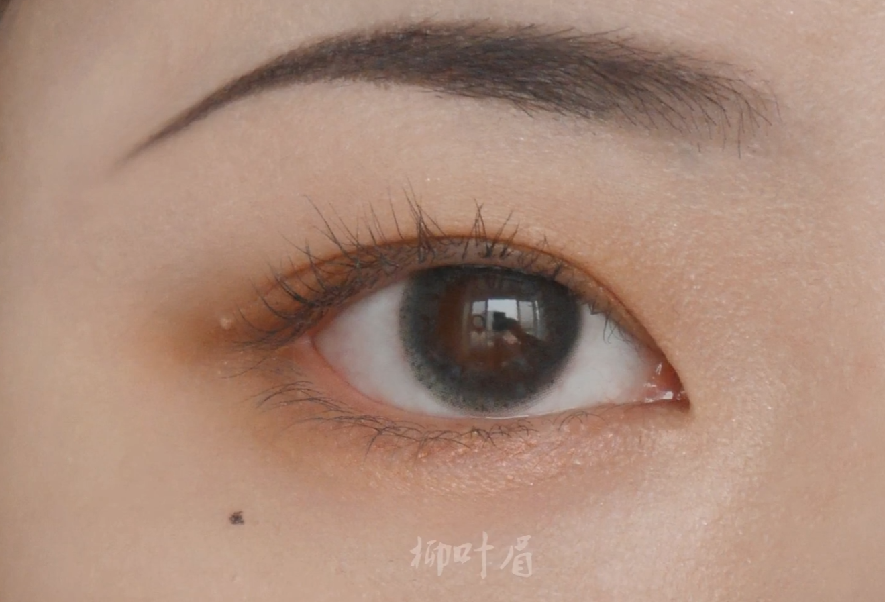
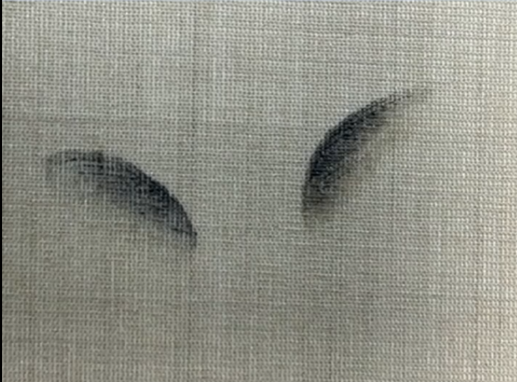
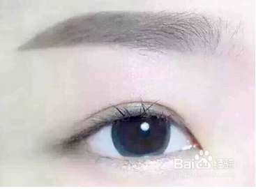
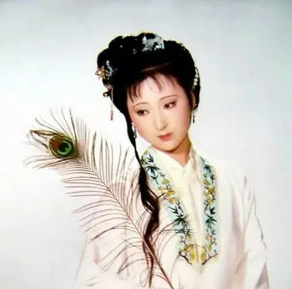
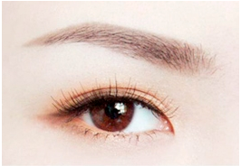
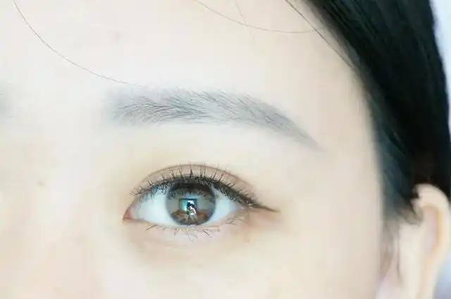
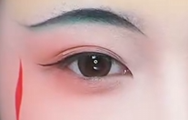
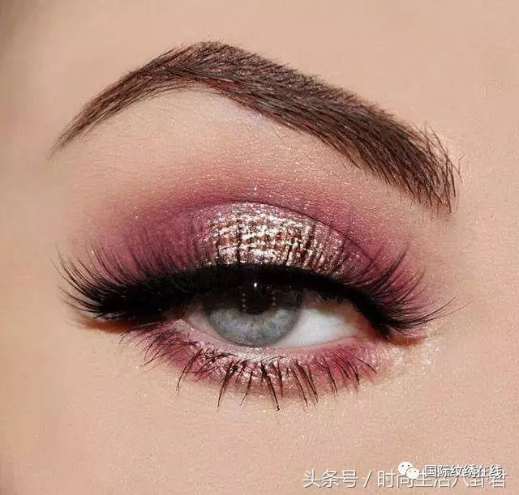

# Brow

## 简述

一眉定江山，眉毛在面部中位置突出，扮演着十分重要的角色，是面部不可缺少的元素。它就像是眼睛的衣服，漂亮的眼睛加上好看眉毛，才会显得眉目传情，顾盼生辉。

## 历史

中国的眉妆，历史悠久、种类繁多，衬托了中国女性的温婉典雅。

中国的画眉起源于战国，兴起于汉代。唐代流行长眉、短眉、蛾眉、阔眉等几十种眉形，开辟了中国历史上眉妆最为丰富的时期。

蛾眉、远山眉、柳叶眉是古代比较有代表性的眉形，其中柳叶眉是东方女性最经典的眉毛，在古代绘画中较多见。

## 类型

- 柳叶眉

眉毛两头尖，弯曲弧度较大，似一片娇柔的柳叶，眉毛从眼头开始长长的画到眼尾后方，略有一点娇羞的姿态，更显女性的温婉娇柔。

- 蛾眉

仿照蚕蛾的触须而画出来的眉毛。

- 一字眉

眉型平直短粗，两眉几乎落在同一水平面上，微有眉峰，在三分之二处稍稍下弯，显得青春活泼、纯朴可爱，使脸部轮廓分明，有比较强烈的视觉效果。

- 罥（juan，四声）烟眉

眉毛淡淡，细长而弯，没有眉峰，似蹙（cu，四声）非蹙，像树梢上飘忽的轻烟，含着淡淡的哀愁，柔情似水，我见犹怜。
罥烟眉出自《红楼梦》中对黛玉的描述“两弯似蹙非蹙罥烟眉，一双似喜非喜含情目”，故而又称黛玉眉。

- 高挑眉

又称欧式眉，有上扬挺拔的倾斜度，眉峰的弧度上挑拉长。

- 落尾眉

眉色较重，眉尾略低于眉头，能展示女性阳光丰腴、生气蓬勃的富家气质，端庄但又没有距离感。

- 标准眉

日常常用眉形。

- 远山眉

是一种淡远、细长的眉毛画法，犹如水墨画中遥远的连山，衬托出清秀淡雅的气质。

远山眉相传为卓文君所创。
葛洪《京西杂记》记载：“文君姣好，眉色如望远山。”不仅当时的普通百姓效仿她，就连汉成帝的爱妃赵飞燕及妹妹赵合德也都模仿她。

- 流星眉

从眉头处缓缓上扬，接着再轻柔的滑下，形成一道似流星划过的痕迹。

- 拱形眉

线条干净利落，眉毛的上下边缘是对称起伏的曲线。眉峰在眉骨上方挑起，而且远高于眉头，眉尾尖锐利落。

## 范例

- 柳叶眉间发，桃花脸上生。

- 眉浅淡烟如柳。

- 懒起画蛾眉，弄妆梳洗迟。

- 两弯似蹙非蹙罥烟眉，一双似喜非喜含情目。

- 文君姣好，眉色如望远山。
