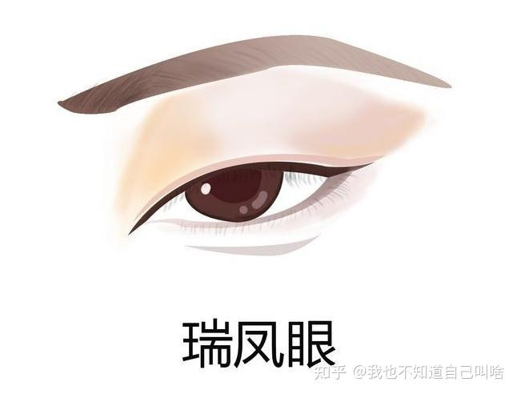
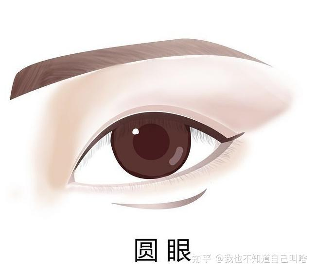
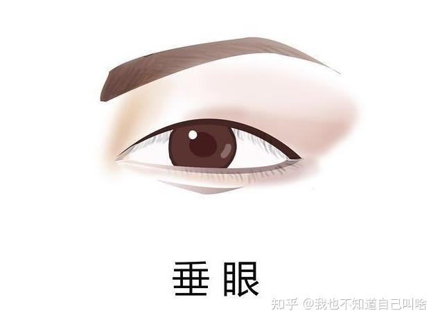
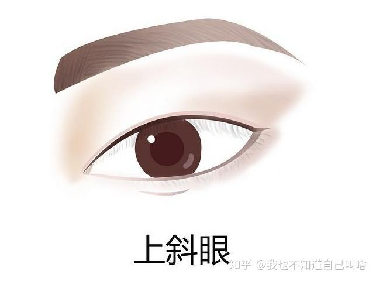
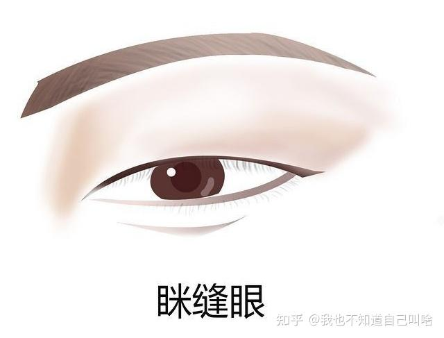
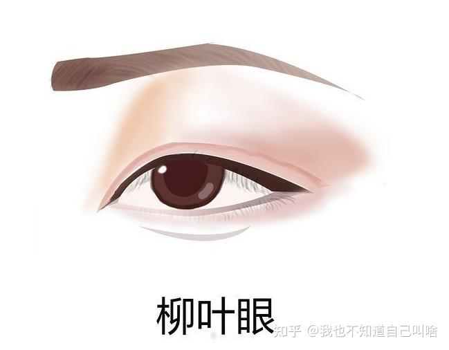
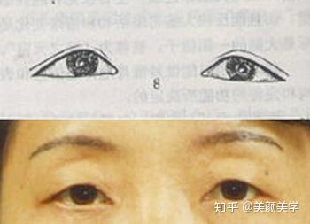
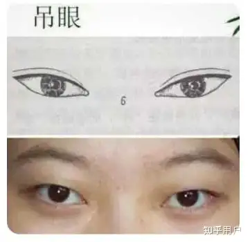

# Eye

## 简述

眼睛是心灵的窗户。
眉为山，眼为水，有山有水好风景。拥有好看眉眼的女子必定是美丽的。

## 类型

- 杏眼

中国人常见眼型，像杏核一样。
眼睛宽度适中，眼裂短，内眦（zi，四声）角较尖、外眦角钝圆，眼瞳与眼白的比例很恰当。尤其是眼皮的褶皱较少，多为内双。
眼神干净清澈，给人以清纯娇憨之感，更显饱满年轻。

- 瑞凤眼

这样的眼睛是最具有气质感的，眼睛细长给人一种凌厉的气势。而瞳孔比较接近，眼角看起来炯炯有神。瞳孔上方有1/3被眼皮所覆盖，所以并不是很大。但是这样的眼睛让人看上去非常的有神韵，属于不是大眼睛，也能透出灵气的一种。

- 圆眼

眼睛圆圆的，显得很可爱。

- 桃花眼

眼睛较细，眼裂长且眼尾微微上翘，内眦角尖而内陷、外眦角细而略弯，似若桃花。含笑时会眯成两道弯弯的月牙儿。
给人以魅惑迷离之感。

- 丹凤眼

眼形细长，内眼角朝下，外眼角狭长且上挑，使得外眦略高于内眦，但整体还是平整的，似丹凤之眼。
凤眼的神韵在于威仪和高贵，黑白分明，神光内敛。

- 垂眼

外眼角下斜​低于内眼角，正面观看呈“八”字形。
有的会显得天真可爱，但有的会显得阴郁或者老态。

- 上斜眼

内斜视眼位向内偏斜.在出生至内发生者称之为先天性内斜视

- 眯缝眼

眼睑裂小狭短，内外眼角均小，黑珠、眼白大部分被遮挡，眼球显小。
虽然缺乏大眼睛的神采和魅力，不过会显得温柔和气。

- 柳叶眼

柳叶眼是中国古典美女的典型眼型，但是很多人以为林黛玉是柳叶眼，然而并不是。柳叶眼的眼型相比较于杏眼比较细一点，扁一点犹如柳叶一样，但是并不是很细长，狭窄的。很多古装剧中的人们眼妆都会刻意画成柳叶眼，也有很多江南女子的温柔扮相，也都是以柳叶眼为主。

- 三角眼

由于上睑皮肤中外侧松弛下垂，外眦角被遮盖显小，使眼裂变成近似三角形。

- 吊眼

又称上斜眼，外眦角高于内眦角，眼轴线向外上倾斜度过高，外眦角呈上挑状。正面观看呈反“八”形。

## 描述

### 称呼

- 眼睛

- 美目

- 眸子

### 形容词

亮晶晶、乌黑、清澈、明亮、黯淡

### 成语

- 媚眼如丝，形容女子的眼波投来，如密密情网，捕获人心。（待查证）

- 盈盈秋水，形容女子眼神饱含感情。出自：元·王实甫《西厢记》第三本第二折：“望穿他盈盈秋水，蹙损他淡淡春山。”

- 眉目传情，用眼色传递情意，多用于男女之间。出处：元·王实甫《西厢记》第三本第一折：“只你那眉眼传情未了时。”

- 双瞳剪水，形容眼睛清澈明亮。出自：唐·李贺《唐儿歌》：“一双瞳人剪秋水。”

- 明眸善睐，形容女子的眼睛明亮而灵活。出自：三国魏·曹植《洛神赋》：“丹唇外朗，皓齿内鲜。明眸善睐，靥（ye，四声）辅承权。”

- 炯炯有神，形容眼睛明亮，有神采。出自：明·李开先《闲居集·九·泾野吕亚卿传》。

### 修辞

- 通过描述眼睛的光芒来展现人物的情绪和神态。例如：“她那双乌黑乌黑的大眼睛，闪烁着迷人的光芒。”、“他眼中的光芒黯淡下来，透出一股悲戚。”

- 通过比拟为天气来展现人物的情绪。例如：“阴云遮住了她的眼睛，像是要落雨了。”

- 将眼睛比作玻璃珠来形容眼睛的澄澈透亮。例如：“两只玻璃珠似的大眼睛里，闪动着青春、热情的光芒。”

- 将眼睛比作星星。例如：“亮晶晶的眼睛，像映在溪水里的星星。”、“这一双眼睛像是苍山顶上的晨星，又圆又亮。”

- 将眼睛比作灯泡来形容眼睛炯炯有神。例如：“这双眼炯炯有神，黑暗中真有点像两只小电灯泡似的。”

- 将眼睛比作泉水来形容眼睛的纯净。例如：“一双泉水般纯净的眼睛里，含着柔和的光亮。”

## 范例

- 两只像海波一样蔚蓝、杏子一般的大眼睛，燃烧着荡动的火焰，发出使人不可抗拒的魅力。

- 一双黑亮黑亮的大眼睛，凝眸时如波澜不兴的黑海，流动时如空中飞走的星星。

- 眼睛里闪耀着智慧的光辉，又敏锐，又细致，让你几乎觉得他有妖法。

- 他眼睛大大的，灰色的。透着一种苦思的神情。

- 那一双眼睛清澈晶莹，微微转动的眼珠流露着一层梦似的光彩。

- 那双眼顾盼生辉，流光溢彩，美丽极了。

- 他的淡蓝色的、玻璃似的眼睛像醉酒似地旋转又旋转，仿佛威势过盛似的。

- 深邃的眼睛，眼珠儿像黑色的玻璃球浸在清水中。

- 浓浓的眉毛下边摆着一对大眼睛，乌黑的眼珠，像算盘珠儿似的滴溜溜乱转。

- 浓眉下面深藏着一对炯灼的眼睛，那里面包含着无边的慈爱。

- 这个人的眼睛真厉害，像个能摄人魂魄的无底洞，谁碰上这样的眼光都会掉进去。

- 眉如墨画，眼若秋波。

温柔的眼神，犀利的目光，充满疑惑的眼睛…用具体的形容词作描写！

例子： 他黑宝石般深邃的眼睛里，闪现着智慧的光芒；她明亮的大眼睛里，充满了无尽的温柔！

那双安静的褐色眼睛，带着那种飘飘欲仙的神气。
她的眼睛．大而黑亮，眼波闪闪溜溜，十分动人。
她的眼珠转动得生动自如，时时闪着睿智的光亮。
本来那么明亮，蓝得那么澄净的眼睛，变得寒光闪闪，像钢铁一般。
这一双眼睛似乎是娇嫩的矢车菊的蓝色，眼神柔和而又温暖。
这眼光斜挑暗视，好像能说话似的。
这黑眼珠定神时如一泓清水，顾盼时像星星流动。
一双浅蓝色的秀长的眼睛稍稍鼓起，和眼眶形成平面，有时因为心血上冲，眼神显得强硬。
一对流光泛彩的眼睛，瞅着什么的时候异常专注凝神，有一股通人的气势，但并不让人觉得犀利。
一双炯炯的有光的淡蓝色的眼睛，充满了人生经验、情感和火焰，当他很安静的时候，那对眼睛使他的脸流露出一种悲哀的善良的表情。
一对尖利的眼光在这年青人的身上霍霍地打圈。
眼聚清波，轻盼曼顾．顿觉有情．原是无情。
这眼睛像海一般深，天空一般的清澈，黎明和黄昏，光明与阴影，都在这里自由嬉戏。

肌肤似白雪
粉面如芙蓉
柳眉
桃花眼睛

工作话题和生活话题都能谈，恋爱话题也可以