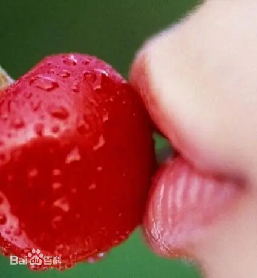

# 嘴

## 描述

### 称呼

- 嘴巴
- 嘴唇
- 嘴角

### 成语

- 樱桃小嘴，形容嘴巴和樱桃一样，嘴唇红润光泽、娇嫩欲滴。出自：唐·孟棨（qi，三声）《本事诗·事感》：“白尚书（白居易）姬人樊素善歌，姬人小蛮善舞，尝为诗曰：樱桃樊素口，杨柳小蛮腰。”

### 修辞

- 将嘴巴和嘴唇比作樱桃来形容嘴唇的饱满、嫣红且富有光泽。例如：“她的嘴唇宛若熟透的樱桃一般，鲜艳、光润、饱满，嘴角微微翘起，总是带着一抹若有若无的微笑，令她显得光彩照人，温婉可爱。”、“她长着一颗樱桃小嘴，让人想要采撷品尝。”
